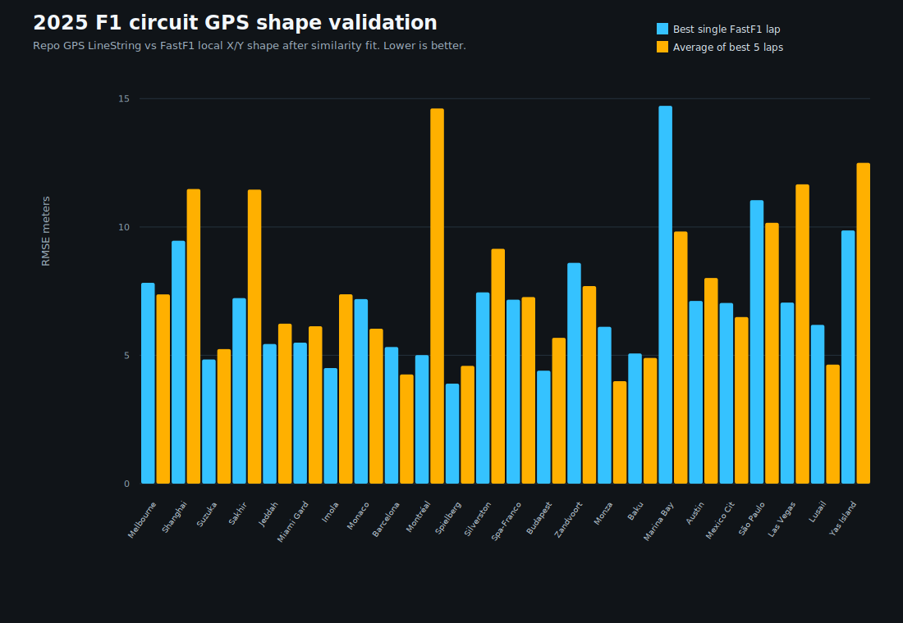
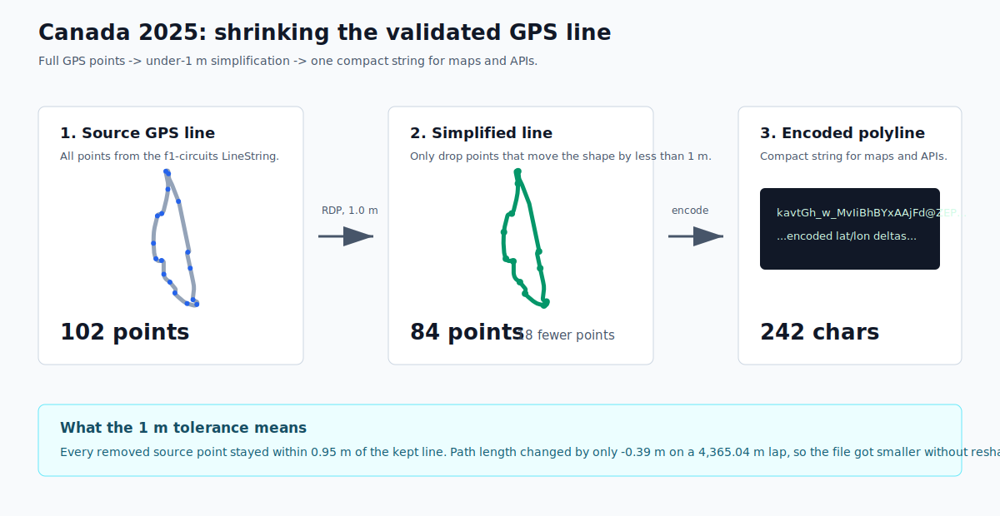
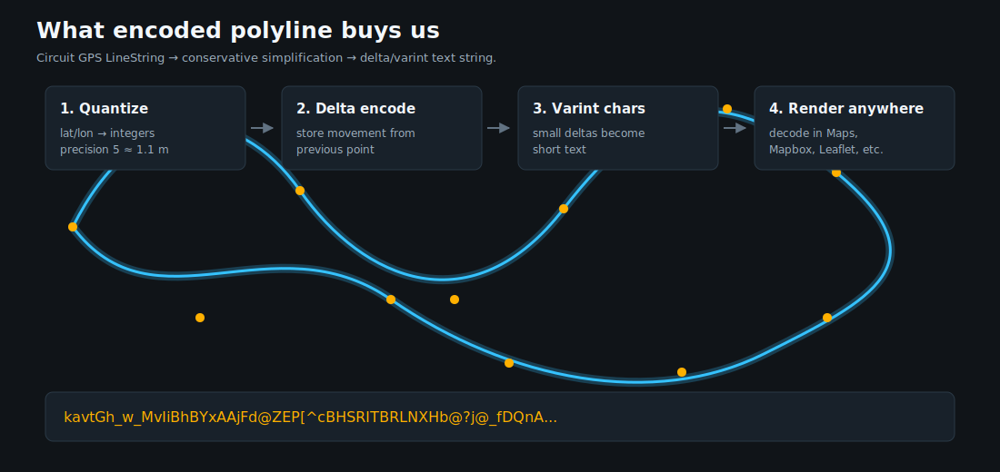

# Apexline

**Apexline checks whether a FastF1 lap's position trace has the same shape as an
oracle Formula 1 circuit GPS LineString. It normalizes lap-boundary overlap,
rejects laps that can't represent one clean loop, and exports diagnostics,
manifests, and compact encoded polylines for maps and spatial tooling.**



## What and Why

FastF1 does **not** provide GPS latitude/longitude for cars — only local circuit
`X/Y/Z` position channels. So you can't ask "how many GPS meters off was this
car?", but you can ask the question Apexline answers:

> Does this FastF1 lap have the same shape as the oracle circuit GPS LineString?

It answers with a geometry fit, and reports *why* a lap was accepted, recovered,
or rejected:

```text
oracle GPS LineString + FastF1 local X/Y lap positions
  -> project to local meters
  -> normalize lap-boundary overlap
  -> resample closed paths
  -> search phase + direction
  -> fit scale / rotate / translate (Procrustes, no warping)
  -> RMSE, p50, p95, max error
  -> validated oracle polyline + lap diagnostics
```

Useful for: validating a lap against the oracle shape, finding laps that aren't
trustworthy evidence, flagging suspicious oracle outlines, picking clean
representative laps, and simplifying GPS polylines without destroying corners.

## How It Works

1. **Load GPS reference** — a circuit LineString from
   [`bacinger/f1-circuits`](https://github.com/bacinger/f1-circuits) (WGS84),
   projected to a local meter plane (equirectangular around the centroid) so
   shape comparison needs no heavy GIS stack.
2. **Load FastF1 positions** — `lap.get_pos_data()[["X", "Y"]]`, treated as local
   shape evidence, not GPS.
3. **Normalize lap-boundary overlap** — FastF1 lap slices can repeat a segment
   near the timing line. Apexline recovers the contiguous one-lap window that
   matches the oracle path length and closes cleanly; otherwise the lap is a
   `path_length_outlier`.
4. **Separate geometry failures from timing warnings** — only checks that
   invalidate the geometry block a lap (`pit_lap`, `too_few_position_samples`,
   `path_length_outlier`). FastF1's `IsAccurate == False` is kept as the
   non-blocking `fastf1_inaccurate` warning, so a real-but-flagged lap still gets
   a full shape fit.
5. **Fit shape to the oracle** — close and resample both paths, search forward/
   reversed direction and circular start offsets, then fit a 2D similarity
   transform `target ~= scale * rotation * source + translation`. Translation,
   rotation, and scale are allowed (FastF1 units aren't GPS); arbitrary warping
   is not, so a wrong shape stays high-residual.
6. **Report shape error** — `rmse_m`, `p50_m`, `p95_m`, `max_m`, plus fitted
   rotation, scale, and phase offset. Compliance thresholds scale with circuit
   length so long tracks don't fail on harmless absolute residuals:

   ```text
   RMSE <= max(32 m, 1.6% of oracle length)
   p95  <= max(75 m, 2.5% of oracle length)
   ```

7. **Shrink the oracle line without moving corners** — drop only points whose
   removal changes the line by less than the tolerance (default `1.0 m`), then
   encode the rest as one compact polyline string. No new shape is invented.





## Worked Example: Canada 2025

Generated by `apexline-canada-examples` from real FastF1 samples. Gray is the
GPS outline; the colored line is the FastF1 trace projected through one transform
learned from a clean anchor lap (Russell lap 63).


| Case | What Apexline sees | Why it matters |
|---|---|---|
| RUS lap 63 | Clean fit, RMSE 3.9 m, p95 6.6 m | Representative clean evidence |
| VER lap 2 | Raw 5012.9 m trace normalized to 4415.1 m on a 4365.0 m oracle, RMSE 28.2 m | Seam repair recovers a usable one-lap window |
| RUS lap 13 | Pit-in lap + timing warning | Projected for inspection, rejected: pit geometry isn't representative |

The point: it doesn't just score a lap, it explains whether the lap is useful,
recoverable, suspicious, or invalid for this geometry task.

## 2025 Season Coverage

Every available 2025 race lap, classified as evidence against the oracle shape.


| Metric | Value |
|---|---:|
| Circuits | 24 |
| Total laps inspected | 26,689 |
| Fitted laps | 25,022 |
| Good laps | 25,019 (93.7%) |
| Shape-threshold failures | 3 |

Almost all rejections happen *before* fitting (`pit_lap`, `path_length_outlier`,
`too_few_position_samples`) and are independently auditable; only 3 fitted laps
failed the proportional shape thresholds. Full breakdowns:
[lap compliance](docs/lap-compliance-2025.md) ·
[validation summary](docs/2025-validation-summary.md).

### Rejected-lap galleries

Audit galleries render every rejected lap with one clean anchor-lap transform
(rejected laps don't learn their own fit, so failures aren't hidden). Timing
warnings alone don't land a lap here — only blocking geometry/data reasons.

<details>
<summary>Canada: 132 rejected laps</summary>


</details>

<details>
<summary>Belgium: 72 rejected laps</summary>


</details>

```bash
.venv/bin/apexline-rejected-galleries --year 2025 --session R --circuits Canada Belgian
```

## Quick Start

```bash
python3 -m venv .venv
.venv/bin/python -m pip install -e .

# Validate one event/session (Race is the default; FP1/Q/SQ/S/R also work)
.venv/bin/apexline validate --year 2025 --event Canada --session R
```

Outputs land in `data/<year>/<event>/<session>/`:

| File | Purpose |
|---|---|
| `circuit-analysis.json` | circuit-level fit and polyline diagnostics |
| `lap-diagnostics.json` | lap-level rejection and compliance diagnostics |
| `artifact-manifest.json` | command, thresholds, source identity, output paths |

Other commands:

```bash
.venv/bin/apexline batch --year 2025 --session R          # full-year batch
.venv/bin/apexline schema-check <lap-diagnostics.json>     # validate an artifact
.venv/bin/apexline fixture-demo --output-dir data/demo     # no-download demo
.venv/bin/apexline-summarize --year 2025                   # season lap-quality summary
```

Needs FastF1 data in `data/fastf1-cache` (or network access to download). The
`bacinger/f1-circuits` repo is cloned into `/tmp/f1-circuits` if missing. JSON
artifacts are stamped with `schema_version`; field-level docs and JSON Schemas
are in [docs/output-schemas.md](docs/output-schemas.md) and [schemas](schemas).

## Limitations

- FastF1 exposes local `X/Y/Z`, not car GPS latitude/longitude.
- Shape-fit metrics are validation metrics, not absolute geodetic error.
- Session availability depends on what FastF1 can download and cache.
- Conservative thresholds can move borderline laps between compliant and rejected.
- Averaged FastF1 traces are driven racing lines, not guaranteed centerlines.

## Documentation

- [Output schemas](docs/output-schemas.md)
- [2025 validation summary](docs/2025-validation-summary.md)
- [2025 lap compliance summary](docs/lap-compliance-2025.md)
- [2025 rejected lap galleries](docs/rejected-lap-galleries-2025.md)
- [Single-session example](examples/single-session.md)
- [Parameter guide](docs/parameter-guide.md)

## License and Data Sources

MIT [LICENSE](LICENSE) for project code. Generated artifacts in `data/` and
`docs/assets/` are checked-in research outputs, not an API contract. FastF1
telemetry remains subject to upstream data-source constraints.

- GPS circuit outlines: [`bacinger/f1-circuits`](https://github.com/bacinger/f1-circuits)
- FastF1 session and position data: [`FastF1`](https://docs.fastf1.dev/)
