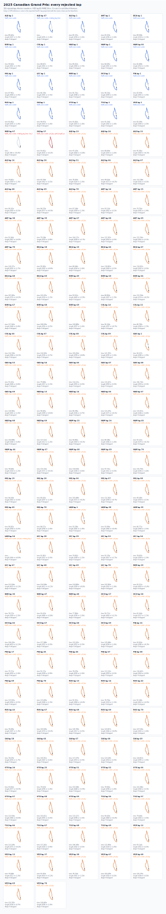

# Rejected lap galleries

Each SVG shows every rejected lap for the event. Rejected laps are
projected with a clean anchor-lap transform for that event; they do not
learn their own rotation or translation.

These galleries were generated with `max_render_points=0`, which renders raw
FastF1 position points without thinning. This preserves chicanes and other
corner-level details at the cost of larger SVG files.

| Event | Rejected laps | Gallery | Data |
|---|---:|---|---|
| Canadian Grand Prix | 192 | [SVG](assets/rejected-laps-2025/10-canadian-grand-prix.svg) | [JSON](assets/rejected-laps-2025/10-canadian-grand-prix.json) |
| Belgian Grand Prix | 290 | [SVG](assets/rejected-laps-2025/13-belgian-grand-prix.svg) | [JSON](assets/rejected-laps-2025/13-belgian-grand-prix.json) |
| Australian Grand Prix | 359 | [SVG](assets/rejected-laps-2025/01-australian-grand-prix.svg) | [JSON](assets/rejected-laps-2025/01-australian-grand-prix.json) |
| British Grand Prix | 330 | [SVG](assets/rejected-laps-2025/12-british-grand-prix.svg) | [JSON](assets/rejected-laps-2025/12-british-grand-prix.json) |

## Canadian Grand Prix

## Belgian Grand Prix

## Australian Grand Prix

## British Grand Prix

