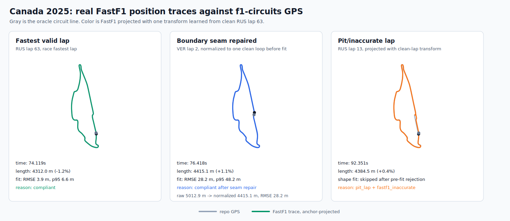
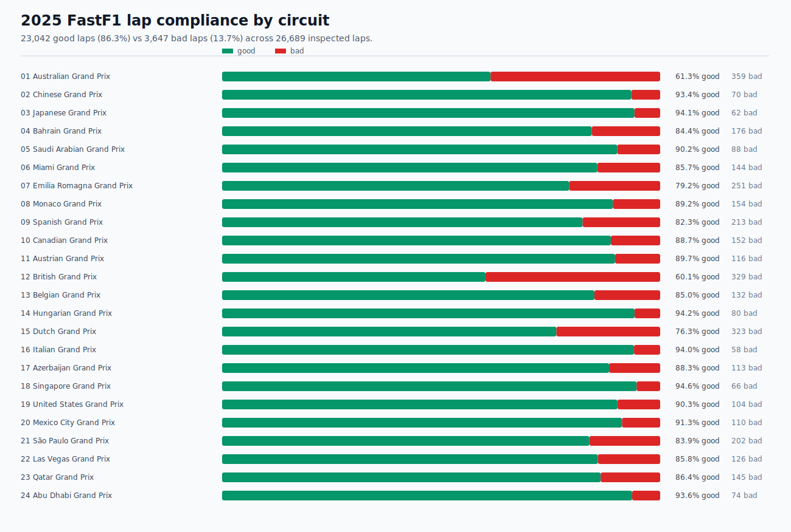

# Apexline Showcase

Apexline validates whether FastF1 lap position traces match an oracle circuit
GPS LineString for a requested year, event, and session. The repo is organized
around single-session validation first, with Canada 2025 as the overlap-repair
proof point and Belgium as the long-circuit calibration case.

## Example 1: Single Race Session

```bash
apexline validate --year 2025 --event Canada --session R
```

This writes:

| Artifact | Purpose |
|---|---|
| `data/2025/canadian-grand-prix/r/circuit-analysis.json` | line fit, polyline, and summary metrics |
| `data/2025/canadian-grand-prix/r/lap-diagnostics.json` | per-lap compliance and rejection reasons |
| `data/2025/canadian-grand-prix/r/artifact-manifest.json` | command, thresholds, provenance, and paths |

The checked-in Canada result demonstrates the main capability:

- 1,349 laps inspected.
- 1,197 geometry-usable laps.
- 152 rejected laps with explicit reasons.
- 84-point compact polyline with less than 1 m simplification error.

The key Canada story is not “bad lap in, bad lap out.” It is “the raw lap slice
looked too long, Apexline trimmed the repeated seam segment, and the recovered
one-lap trace passed the oracle fit.”



Belgium 2025 shows why long circuits need proportional thresholds. Its 747
fitted laps pass shape validation; the remaining rejects are FastF1 metadata or
pit-lap exclusions:


## Example 2: Non-Race Session

The same command model works for any FastF1-supported session code:

```bash
apexline validate --year 2025 --event Canada --session Q
```

Qualifying and practice sessions may have fewer laps or different telemetry
quality. Apexline records the session in every artifact and in each `lap_key`,
so race and non-race laps cannot collide downstream.

## Example 3: Full-Year Batch

```bash
apexline batch --year 2025 --session R
apexline-summarize --manifest data/2025/all-events/r/artifact-manifest.json
```

Batch mode is useful for season-level summaries and galleries. It is not
required for normal use; single-session validation is the primary workflow.



Current 2025 season totals:

- 26,689 laps inspected.
- 23,042 good laps (86.3%).
- 3,647 bad laps (13.7%).
- 0 shape-threshold rejects after visual calibration.

For the deeper analysis, use
[../notebooks/2025-season-insights.ipynb](../notebooks/2025-season-insights.ipynb).

## No-Download Demo

```bash
apexline fixture-demo --output-dir data/fixture-demo
apexline schema-check data/fixture-demo/lap-diagnostics.json
apexline-summarize --manifest data/fixture-demo/artifact-manifest.json
```

The fixture proves the artifact and visualization path without requiring
FastF1 downloads.
